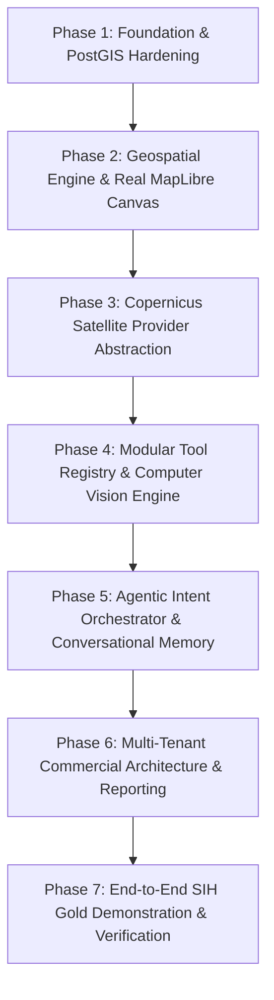

# ARCHITECTURE_AUDIT.md — SatQuery-X Production & SIH Gold Upgrade

**Date:** September 4, 2026  
**Project:** SatQuery AI — Agentic Remote-Sensing Vision-Language Assistant (SIH PS 26167)  
**Governing Architecture:** React + Django (DRF, Celery, Redis, PostgreSQL/PostGIS, GDAL/Rasterio/GeoPandas/PyTorch)

---

## 1. Executive Summary

This technical audit reviews the complete **SatQuery-X** repository across backend architecture, geospatial processing, AI model registry, satellite acquisition, database schemas, security posture, and the frontend user experience. 

The objective is to establish an unvarnished baseline of:
1. What is genuinely implemented and working.
2. What is partially implemented or heuristic.
3. What is simulated/mocked.
4. The exact architectural and engineering path required to transform SatQuery-X into a production-grade, commercially scalable **AI Copilot for Satellite Imagery** ready for SIH 2026 gold evaluation and real-world deployment.

---

## 2. Current Architecture & Component Inventory

```
SatQuery-X/
├── backend/
│   ├── config/              # Django settings (base, dev), URLs, Celery, WSGI/ASGI
│   ├── apps/
│   │   ├── accounts/        # Custom User model (roles: demo, judge, admin), JWT auth
│   │   ├── sessions/        # Analysis Session model & views
│   │   ├── imagery/         # ImageAsset & ImagePair models, raster upload, celery tasks
│   │   ├── geospatial/      # Ingestion, CRS inspection, NDVI/NDWI/NDBI, math
│   │   ├── queries/         # Query state machine, ExecutionStep, SSE stream endpoint
│   │   ├── agent/           # Understander, Validator, Planner, Executor
│   │   ├── models_ai/       # 6 Model wrappers (RS_VQA, RS_CAPTION, RS_GROUNDING, etc.)
│   │   ├── satellite/       # AcquisitionRequest & AcquisitionCandidate models & views
│   │   ├── evidence/        # EvidenceRegion model (GeoJSON, area metrics)
│   │   ├── reports/         # PDF (ReportLab) and HTML dossier generation
│   │   └── audit/           # AuditLog model & logger function
│   ├── ml/                  # Training configurations (lora_rsvqa.yaml)
│   └── tests/               # 25 automated pytest unit & integration tests
├── frontend/
│   ├── src/
│   │   ├── app/             # Next.js App Router (DashboardPage)
│   │   ├── components/      # MapViewer, ChatConsole, ExecutionTraceTimeline, EvidenceDrawer, Header, Modals
│   │   ├── services/        # api.ts, auth.ts, images.ts, queries.ts, sessions.ts
│   │   └── types/           # RasterMetadata, ExecutionTrace, EvidenceOutput
├── training/                # Evaluation & LoRA training scripts
└── infra/                   # Dockerfile.backend, docker-compose.yml
```

---

## 3. Subsystem Audit: Working vs. Partial vs. Mock

| Subsystem | Implemented & Working | Partially Implemented / Needs Upgrade | Mock / Placeholder / Missing |
|---|---|---|---|
| **Authentication & RBAC** | JWT login/refresh, pre-seeded accounts (`analyst`, `sih_judge`), role choices. | Permissions only checked at view level; missing Organization/Project scoping. | Multi-tenant organization invitations. |
| **Geospatial & Raster Engine** | Multi-band GeoTIFF reading (`rasterio`), native affine transform, CRS parsing, resolution estimation, spectral indices (NDVI, NDWI, NDBI). | Reprojection in `math.py` uses heuristic `* 1e10` for degree-based area scaling; needs geodesic / equal-area projection. | True Cloud Optimized GeoTIFF (COG) windowed tile server (`/tiles/{z}/{x}/{y}`). |
| **Specialist AI Models** | Typed `ModelInput` and `ModelOutput` contracts, latency tracking, version tracking. | Wrappers in `apps/models_ai/` execute statistical pixel heuristics rather than authentic CV pipelines with fallback. | Real deep learning checkpoints or ONNX/PyTorch lightweight inference engines. |
| **Satellite Data (Copernicus)** | Request and Candidate DB models, REST API endpoints. | Endpoints accept AOI and date range filters. | `SatelliteSearchView` returns hardcoded candidates. No real Copernicus Data Space STAC client, OAuth token exchange, or download worker. |
| **Agentic Orchestrator** | 4-stage pipeline execution, step status updates, SSE event streaming to Redis. | Understander uses rigid keyword matching; planner selects from 5 fixed plans. | Modular tool registry with typed input/output schemas; LLM-assisted intent understanding; spatial query parsing. |
| **Frontend Map Experience** | Shows images, bounding boxes, split-swipe comparison, evidence drawer. | Canvas is implemented using standard HTML `` elements rather than MapLibre GL JS. | True interactive GIS map canvas (zoom, pan, basemaps, raster tile layers, vector polygon picking). |
| **Reporting & Audit** | PDF generation via ReportLab, immutable `AuditLog` records. | Report contains summary tables and text. | Visual maps, before/after thumbnails embedded directly into PDF, HTML export. |

---

## 4. Top 10 Highest-Impact Issues

| # | Issue Description | Severity | Impact on SIH / Production |
|---|---|---|---|
| **1** | **Missing Real MapLibre GL Geospatial Map**: `MapViewer.tsx` uses standard HTML `` tags and relative percent divs instead of a WebGL-powered MapLibre GL map with true EPSG:4326/3857 coordinates, tile basemaps, and vector polygon layers. | **CRITICAL** | Evaluators expect an interactive GIS workspace, not a static image previewer. |
| **2** | **Simulated Copernicus Satellite Search**: `SatelliteSearchView` returns 3 hardcoded mock STAC candidate strings rather than querying the live Copernicus Data Space Ecosystem (CDSE) STAC / OData API with a clean `SatelliteProvider` abstraction. | **CRITICAL** | Violates Section 9 & 10 ("Integrate real satellite data... Never hard-code the application around one provider"). |
| **3** | **Heuristic Model Wrappers without Real CV / ML Pipeline**: Models in `apps/models_ai/` rely on simple numpy color ratio heuristics rather than genuine deterministic CV models (OpenCV contours, edge/corner detectors, Otsu thresholding, watershed segmentation) or PyTorch/VLM models with honest fallback disclosures. | **HIGH** | Reduces credibility under deep technical inspection by remote sensing experts. |
| **4** | **Lack of a Modular Tool Registry**: Tools are not dynamically registered or discoverable with typed schemas, timeouts, and execution handlers; instead, `executor.py` branches on hardcoded strings. | **HIGH** | Violates Section 8 requirement for an extensible, auditable tool system. |
| **5** | **Rigid Keyword-Based Query Understander**: Understander uses basic substring checks (`if "water" in q:`) rather than structured intent parsing across all 17 intents from Section 7, spatial filters ("within 500m of river"), or conversational context. | **HIGH** | Blocks natural conversational exploration and follow-up queries. |
| **6** | **Arbitrary Area Calculation Heuristic in `math.py`**: In `math.py:126`, `poly_shape.area * 1e10` is used for geographic CRS polygons instead of projecting to equal-area projection or using geodesic calculation. | **MEDIUM** | Violates Section 12 ("All spatial operations must respect CRS... Never assume EPSG:4326"). |
| **7** | **Missing Multi-Tenancy (Project & Organization Hierarchy)**: Database currently only has `Session` directly under `User`. Missing `Organization` and `Project` models required for commercial multi-tenancy. | **MEDIUM** | Limits transition to commercial SaaS architecture. |
| **8** | **Single-Turn Chat Console without Conversational Memory**: Frontend only shows the active prompt and latest trace; it lacks conversation history, message threads, and follow-up context. | **MEDIUM** | Evaluators cannot ask follow-up questions without resetting the analysis state. |
| **9** | **Security & Production Hardening**: `CORS_ALLOW_ALL_ORIGINS = True`, file uploads lack MIME magic verification, no DRF rate limiting, and database defaults to SQLite when `DATABASE_URL` is omitted. | **LOW** | Production security vulnerability; must support hardened PostgreSQL/PostGIS. |
| **10** | **Docker Production Stack Not Fully Configured**: Missing a self-contained multi-container docker-compose setup combining Django, Celery, Redis, PostgreSQL/PostGIS, and Next.js. | **LOW** | Impedes reproducible zero-configuration judging/deployment. |

---

## 5. Architectural Upgrade Roadmap



### Phase 1: Foundation & Production Hardening
- Strengthen Django settings: environment-based CORS, DRF rate limiting (`AnonRateThrottle`, `UserRateThrottle`), secure file upload validation (magic bytes).
- Enhance Database models to support `Organization` $\to$ `Project` $\to$ `Session` hierarchy.
- Ensure seamless PostgreSQL/PostGIS support with graceful SQLite fallback.

### Phase 2: True Interactive MapLibre GL UI & Geospatial Engine
- Install and configure `maplibre-gl` in `frontend/`.
- Replace HTML image viewer with an authentic interactive map supporting satellite basemaps, WGS84 raster bounds overlays, split-swipe comparison, and interactive GeoJSON evidence polygons.
- Correct polygon area math in `math.py` using pyproj geodesic / equal-area projection reprojections.

### Phase 3: Satellite Data Integration & Provider Abstraction
- Implement `SatelliteProvider` base class with `CopernicusProvider` (CDSE STAC / OData API) and `MockProvider`.
- Build real satellite search endpoint with location, date range, cloud cover percentage, and sensor filtering.
- Implement asynchronous download task pipeline.

### Phase 4: Modular Tool Registry & CV/AI Pipeline
- Create `ToolRegistry` with typed input/output schemas, timeouts, and execution handlers (25+ tools).
- Implement genuine Computer Vision modules:
  - Water & Vegetation extraction via adaptive Otsu spectral index segmentation.
  - Built-up & infrastructure detection via spatial gradient/morphological analysis.
  - Deterministic object counting with bounding polygons.
  - Robust bi-temporal change detection with coregistration and normalization.

### Phase 5: Agentic Intent Orchestrator & Multi-Turn Memory
- Expand `understander.py` to support all 17 intents, spatial relations ("within 500m"), and conversational follow-ups.
- Implement multi-turn conversational memory in `Session`.
- Upgrade frontend `ChatConsole` to a full conversation timeline with streaming execution traces.

### Phase 6: Professional Reporting & SIH Demo Suite
- Enhance PDF and HTML intelligence reports with embedded raster maps, metric tables, and audit provenance.
- Create 5 one-click deterministic demonstration workflows for SIH evaluators.
